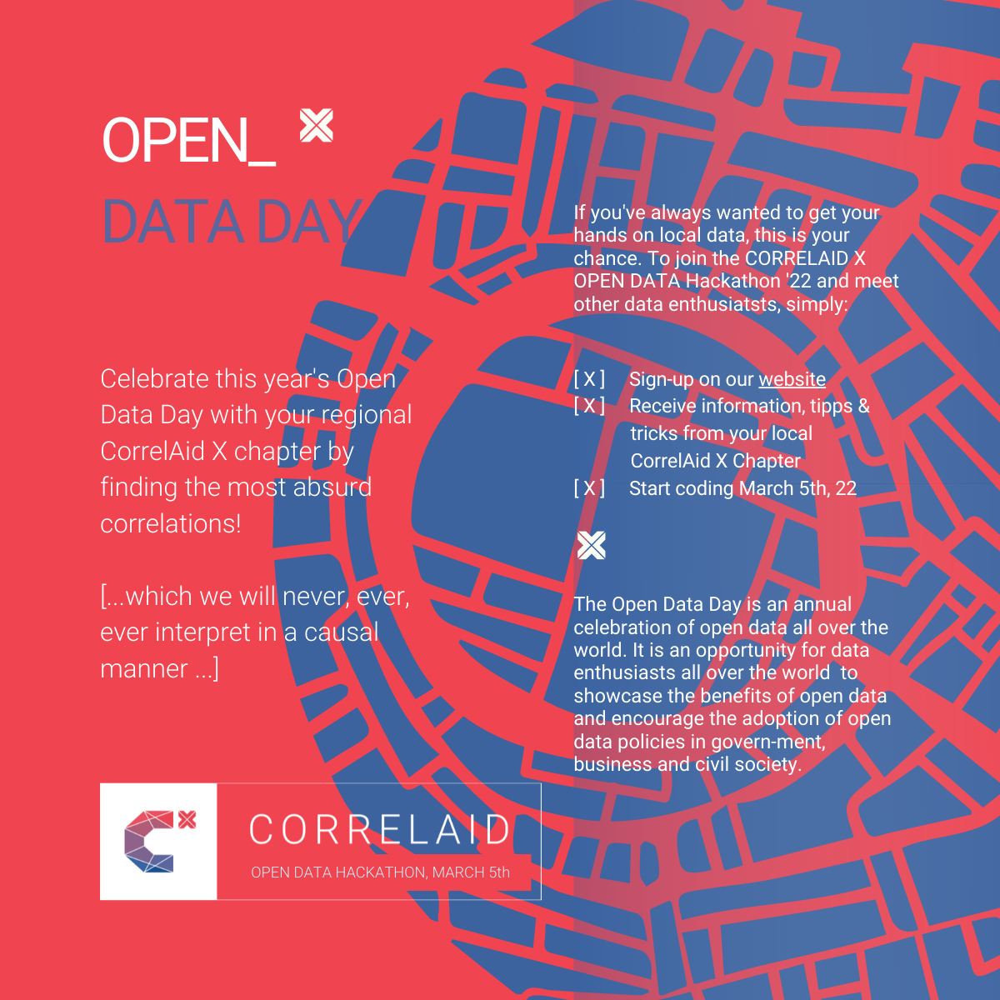
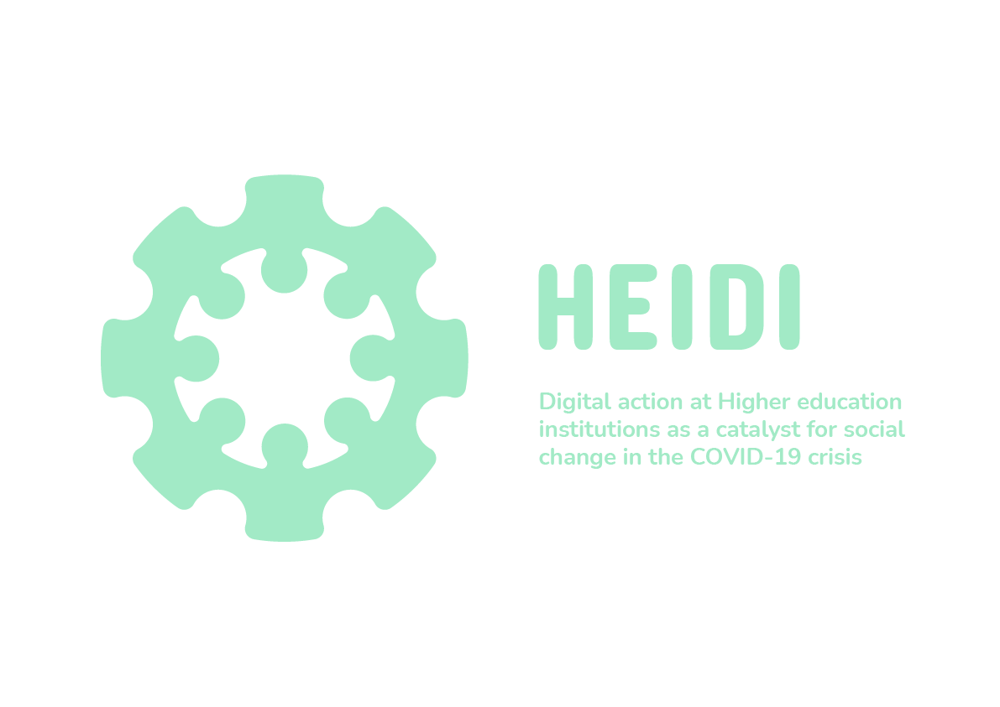

# Open Data Day 2022 - Paris
For the [Open Data Day 2022](https://opendataday.org/) the [local chapter of CorrelAid in Paris](https://correlaid.org/en/correlaidx/paris/) organized a [hackathon](https://events.cri-paris.org/e/96/open-data-day-hackathon-paris-in-numbers). Under the topic "Paris in Numbers" the participants worked on a challenge suggested by the City of Paris - "Mission vélo". We also shared some [other open datasets](https://github.com/cityinteractionlab/open_data_days_2022) for inspiration.

## The challenge
The [City of Paris' innovation office and mobility department](https://www.paris.fr/a-velo) kindly shared with us a real-world challenge: Increasing the offer of bike parking spots in Paris (__"Mission Vélo"__). They would like to base their decisions on data, to create efficient and relevant results. They shared with us some directions they identified so far to visualize the existing situation, identify the main facilities and businesses that don't have bicycle parking in immediate vicinity, the usage of vélib (rental bikes), to just name a few.

__They also suggested us a range of open datasets, for example:__
* Availability of vélib bikes : https://opendata.paris.fr/explore/dataset/velib-disponibilite-en-temps-reel/
* Localisation of vélib stations : https://opendata.paris.fr/explore/dataset/velib-emplacement-des-stations/
* Bike counting : https://opendata.paris.fr/explore/dataset/comptage-velo-donnees-compteurs/
* Temporary bike lanes : https://opendata.paris.fr/explore/dataset/deconfinement-pistes-cyclables-temporaires/
* A list of datasets that correspond to the search « velo + espace public » (bike and public space) : https://opendata.paris.fr/explore/?disjunctive.theme&disjunctive.publisher&disjunctive.keyword&disjunctive.modified&disjunctive.features&sort=modified&q=v%C3%A9lo&refine.theme=Mobilit%C3%A9+et+Espace+Public
* Data prepared and featured at City Interaction lab Paris https://github.com/cityinteractionlab/open_data_days_2022 

## Participants
__Group 1:__ [@Nathanlauga](https://github.com/Nathanlauga), Jane, Yu-Ying

__Group 2:__ [@romainattie](https://github.com/romainattie), [@lilyatant](https://github.com/lilyatant), Ariane

## Methods and results
In a 6h hackathon, the participants formed groups, picked a challenge, familiarized themselves with the task and data, and conducted some analyses.
The results and notebooks can be found __[here (group 1)](https://github.com/CorrelAid/open_data_22_paris/tree/main/group_1)__ and __[here (group 2)](https://github.com/CorrelAid/open_data_22_paris/tree/main/group_2)__.

### Recording of group presentations

## Organizers
Hackathon initiated and led by [CorrelAid](https://github.com/CorrelAid).

Local organization in Paris by [@Liyubov](https://github.com/Liyubov), [@chetanniyan](chetanniyan), and [@katoss](https://github.com/katoss). 

## Support

  
  
  

